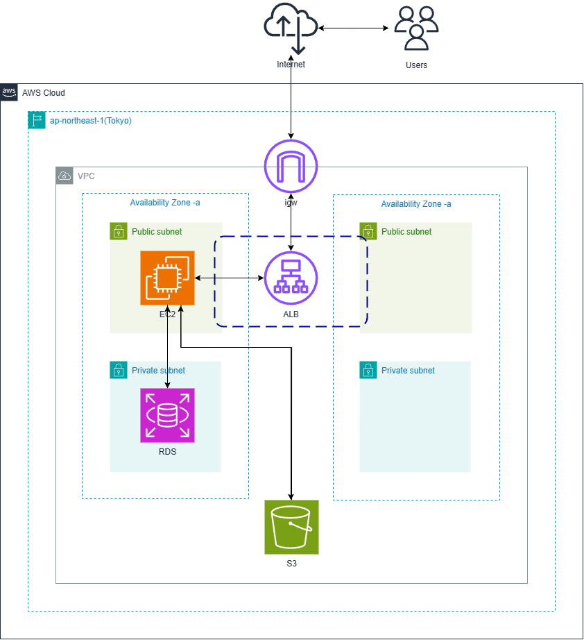

# AWSコースの学習記録
2023年10月17日より、オンラインスクール「[RaiseTech](https://raise-tech.net/courses-lp/aws-full-course)」にてAWSコースの受講を開始。 
全16回の講義の内、第12回までの受講が済んでおり、第13回は現在学習中。 
それ以降は今後学習予定。 

 
 

| 授業№ | 主な学習内容 | アウトプット |
|:---:|---|---|
| 1 | - AWSとは | - AWSアカウント作成  - IAMの推奨設定  - Cloud9の作成  - Rubyを実行して「Hello World」を表示 |
| 2 | - バージョン管理システム  - Git  - GitHub  - Markdown | **[lecture02](./lecture02.md)**  - GitHubアカウントを作成  - Git設定  - Pull Request |
| 3 | - Webアプリケーションとは  - システム開発の流れ  - 外部ライブラリと構成管理の重要性 | **[lecture03](./lecture03.md)**  - Railsサンプルアプリケーションのデプロイ  - APサーバー、DBサーバーについて |
| 4 | - AWSでの権限管理  - EC2・RDSとは | **[lecture04](./lecture04.md)**  - IAM権限管理とAWS上でのネットワーク ～ EC2、RDSの作成 |
| 5 | - ELB・S3について  - インフラ構成図 | **[lecture05](./lecture05.md)**  - EC2上でアプリケーションのデプロイ  - ELBとS3の構築  - 構成図の作成 |
| 6 | - システムの安定稼働とAWSでの実装・確認 | **[lecture06](./lecture06.md)**  - CloudTrailのイベント確認  - CloudWatchアラームの動作確認  - AWS利用料の見積書を作成  - コスト管理|
| 7 | - システムにおけるセキュリティの基礎  - セキュリティ対策 | **[lecture07](./lecture07.md)**  - 考察と対策|
| 8 | - 第4回・第5回授業内容の実演 | ― |
| 9 | - 第4回・第5回授業内容の実演 | ― |
| 10 | - CloudFormation | **[lecture10](./lecture10.md)**  - AWS環境のコード化 |
| 11 | - インフラのコード化を支援するツール  - インフラのテストとは  - テスト駆動環境  - ServerSpec |  - ServerSpec のテスト |
| 12 | - Terraformの解説  - DevOps  - CI/CDツールとは |  - CircleCI のサンプルコンフィグの組み込み |
| 13 | - 構成管理ツールとは  - Ansible  - OpsWorks  - CircleCIとの併用 | **学習中** - CircleCI のサンプルに ServerSpec や Ansible の処理を追加 |
| 14 | - 第13回授業内容の実演 | **今後学習予定**  - AWS 構成図、自動化処理がわかる図、リポジトリのREADME作成 |
| 15 | - 第13回授業内容の実演 | **今後学習予定** |
| 16 | - 現場へ出ていくにあたって | **今後学習予定** |

 
 

## CloudFormationで構築した環境

 

 

第10回講義の課題で、これまでに構築した環境（上図）をCloudFormationでコード化し、自動で環境が構築されることを確認。 
[第10回課題](/lecture10.md)

 

### 【 工夫した点 】
- 既存の環境とリファレンスページを見比べ、テンプレートに記述するリソースを厳選した
- MyIPやPasswordをハードコードしないようにした
- エラーの解消速度向上のために、VSCodeにcfn-lintを導入した
- 学習に取り組みながら[lecture10](./lecture10.md)に過程をまとめ、どこで躓いたか等の振り返りができるようにした

 

## 2024年7月現在
- AWS Certified Solutions Architect - Associate 取得済み
- RaiseTech AWSコース 第13回授業内容を学習
- Linuc level1学習中