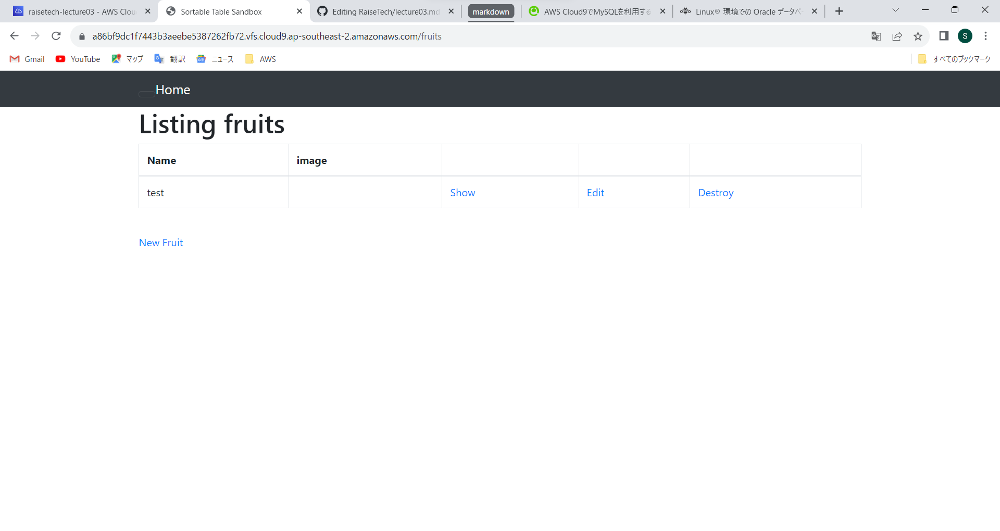
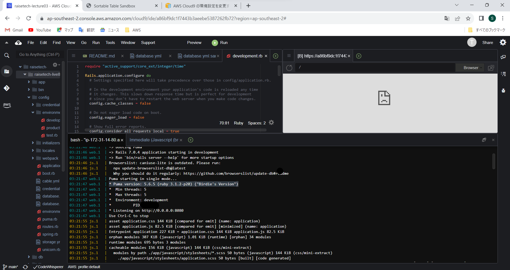
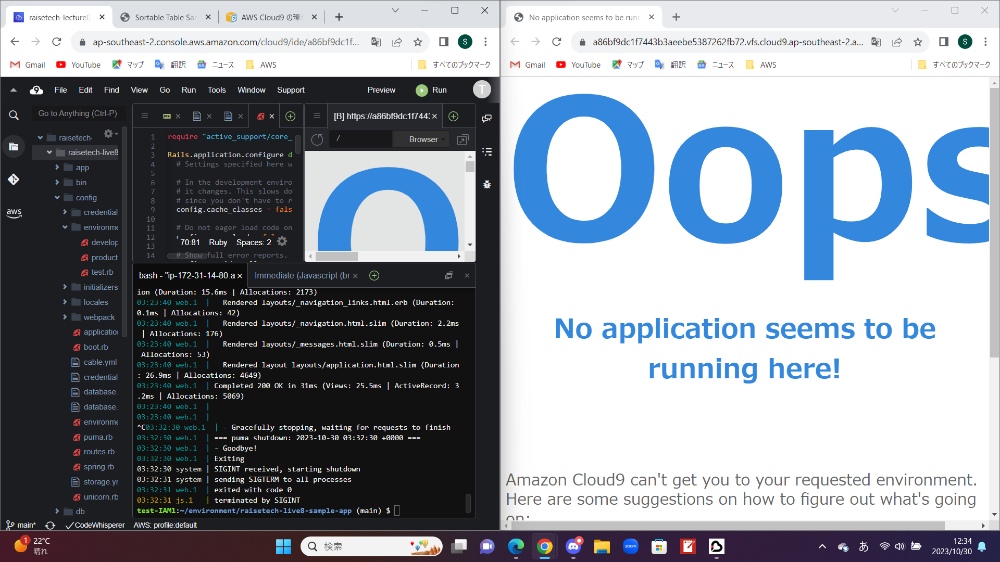
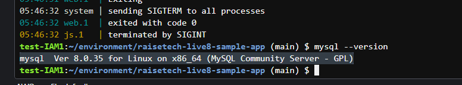
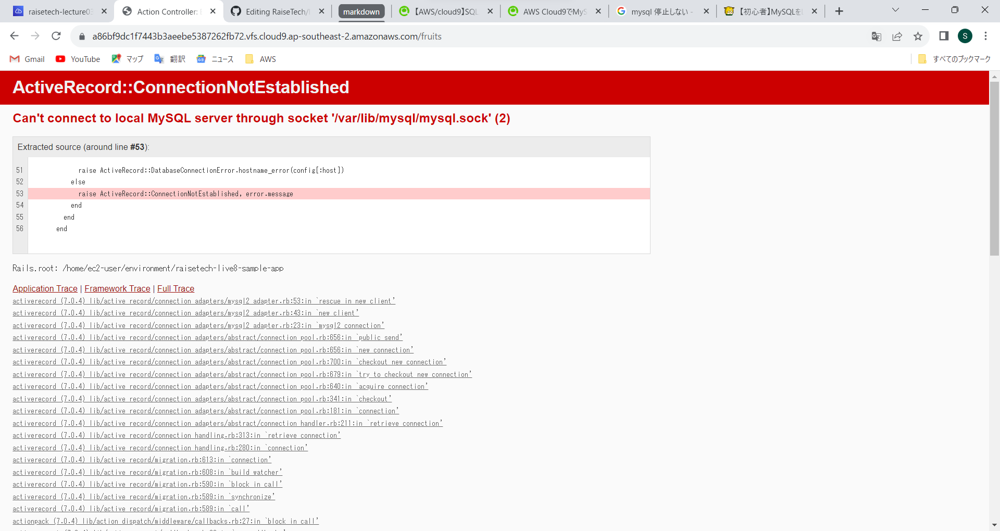
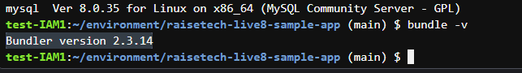

# Lesson03

・サンプルアプリケーションの起動

## APサーバーについて
アプリケーションサーバーの略称。Webサーバーより受け取った情報を処理するためのモノ。
 プログラミング言語で構築されたアプリを実行して、動的なコンテンツを生成している。

・名前（Puma）
 ・バージョン5.6.5
 

・ APサーバーを終了させるとアプリケーションにアクセスできない

## DBサーバーについて
DBサーバ（データベースサーバ）とは、データを一元管理し、データの検索、更新、保存、バックアップ を行うサーバのこと。
  Web3層構造のWebシステムでは最下層に位置し、APサーバからの要求に基づき データの検索やデータの更新（追加、修正、削除）を行っている。

・名前（mysql）
 ・バージョン8.0.35
 
)

・DBサーバーを停止させるとアプリケーションにアクセスできない

## Railsの構成管理ツール

・名前（Bundle）
 ・バージョン2.3.14
 

## 今回の課題から学んだこと

・内容を変更した際にしっかりと保存をすること
 ・アプリケーションの起動
 ・APサーバーとDBサーバーの違い
 ・githubに画像をアップロードして、githubから画像を持ってくる方法
 第3回講座動画内でのデモンストレーションがあったからどうにか出来たものの、一人でやれと言われたら自信が無いので今後の講座の課題などを通して自信をつけていきたい。
