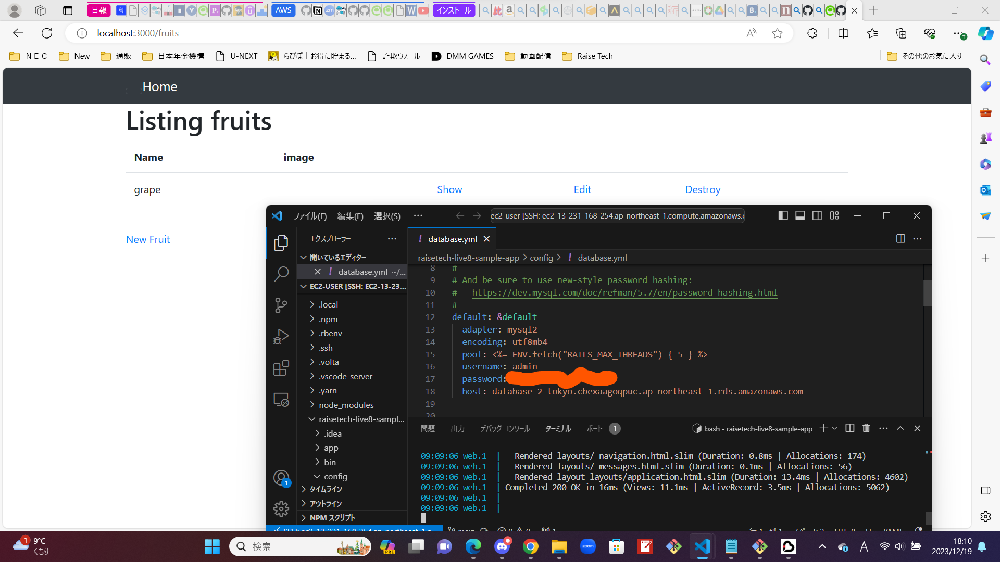
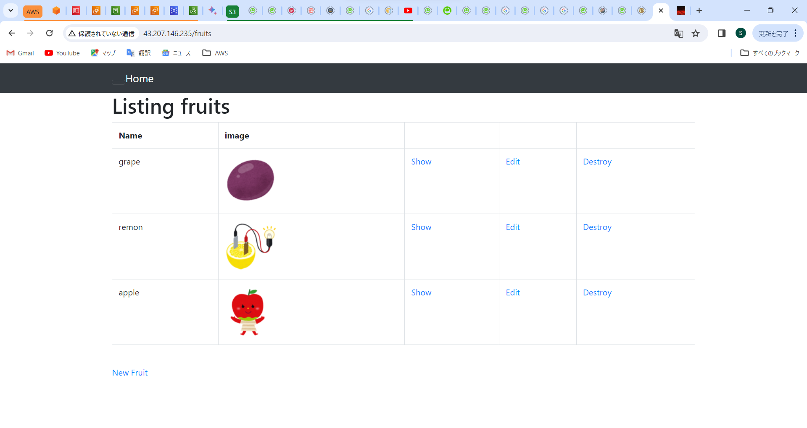
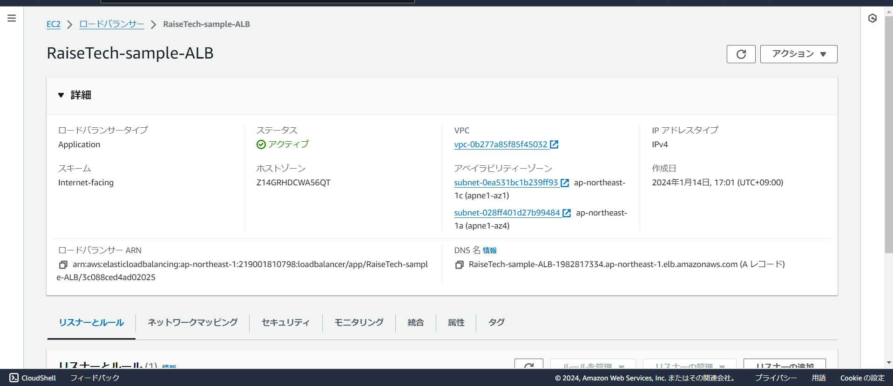
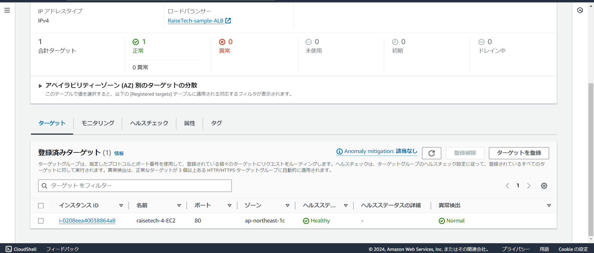
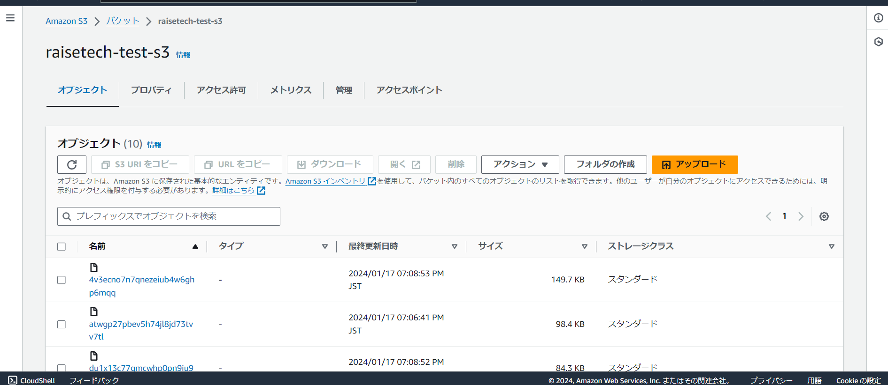
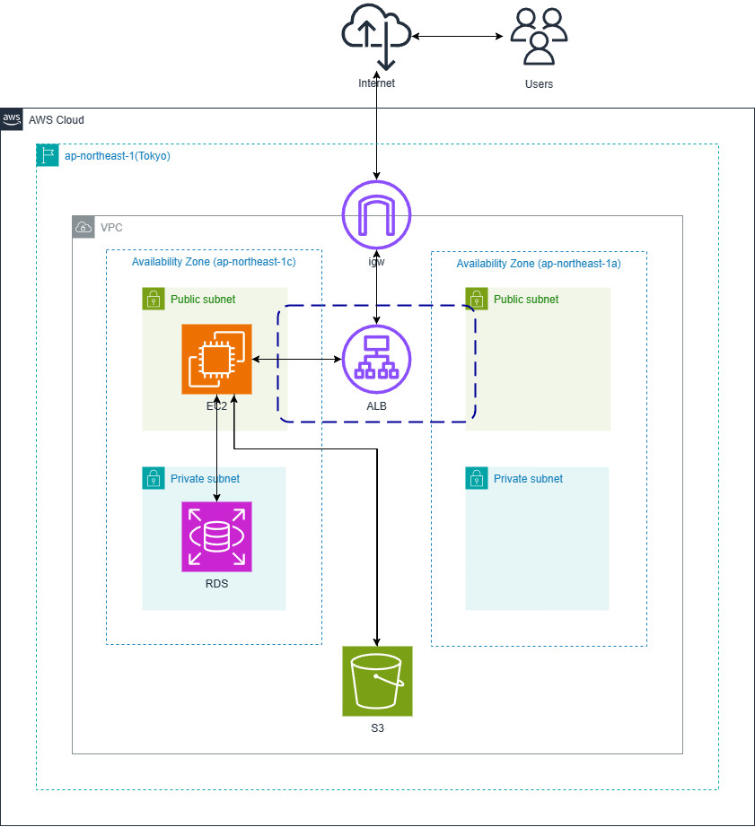

# lecture05

## 課題

    1. EC2にサンプルアプリケーションをデプロイ
    2. ELB(ALB)を追加
    3. S3を追加
    4. 構成図を作成

# 1. EC2にサンプルアプリケーションをデプロイ

## 組み込みサーバでデプロイ

## サーバを分けてデプロイ(S3適用済み)

# 2. ELB(ALB)を追加

## ALB

# 3. S3を追加

# 4. 構成図を作成

