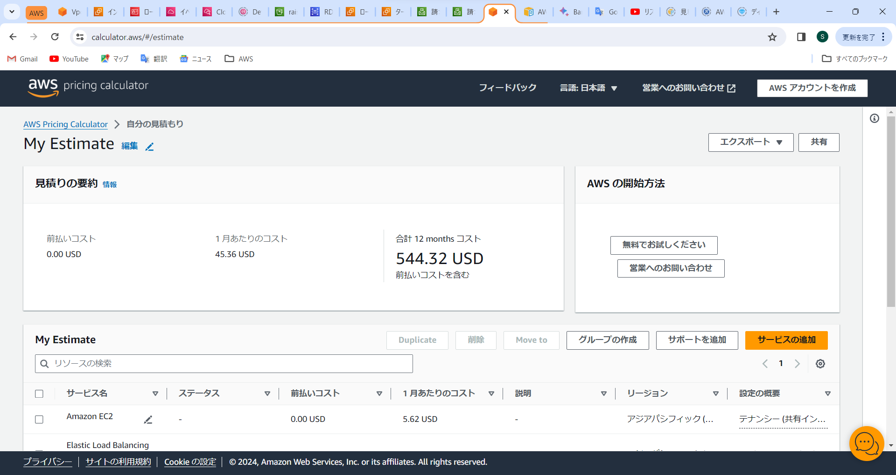

# lecture06

## 課題

1. 最後にAWSを利用した日の記録をCloudTrailから探し出して、イベント名と含まれている内容3つをピックアップ
2. CloudWatchアラームを使って、ALBのアラームを設定し、メール通知をしてみる
3. AWS利用料の見積を作成
4. マネージメントコンソールから現在の利用料を確認して報告

# 1. CloudTrail

* イベント名：ConsoleLogin
* ユーザー名：test-IAM1
* イベント時間：1月24,2024,15:11:22(UTC+09:00)
* イベントソース：signin.amazonaws.com

# 2. CloudWatch

### CloudWatchの設定

### 異常時

### 正常時

# 3. AWS利用料の見積

見積りを取得するには、以下のリンクを使用する必要がある。このリンクの有効期間は 1 年間。

[見積 2024/01/26](https://calculator.aws/#/estimate?id=876729dffa7c17e219c5655d668950b93b7f2ed8)

リンクに有効期限があるためスクリーンショットも掲載

# 4. 現在の利用料

* 12月利用料

* EC2利用料
