# lecture10

## 課題

1. CloudFormation を利用して、現在までに作った環境をコード化する。
2. コード化ができたら実行してみて、環境が自動で作られることを確認。

## VPC

[VPC用テンプレートファイル (VPC.yml)](CFn-template/VPC.yml)

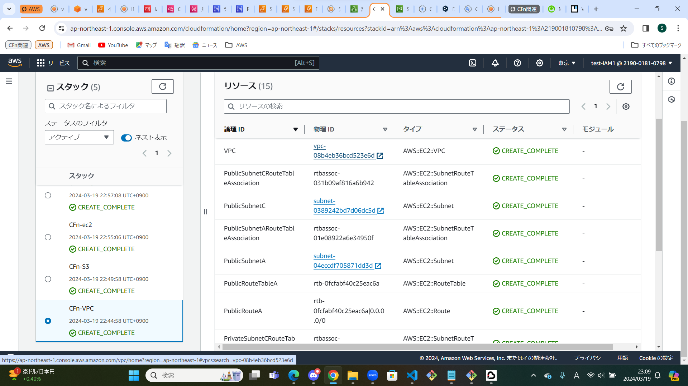
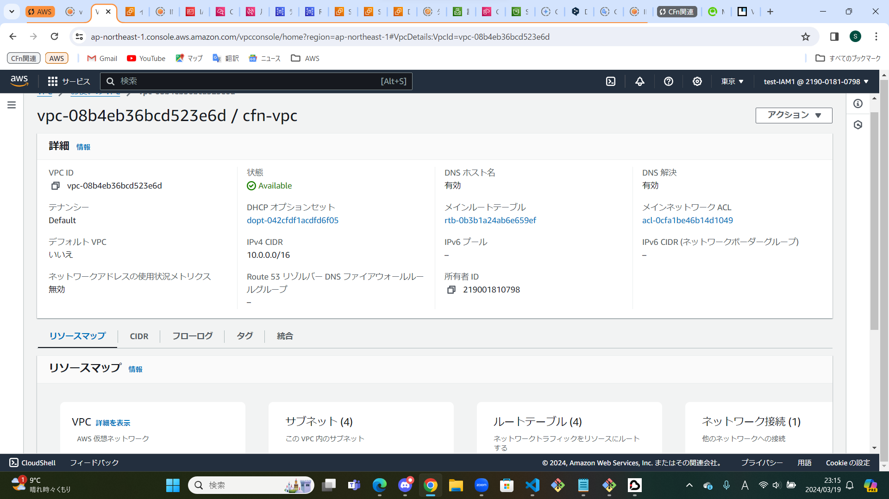
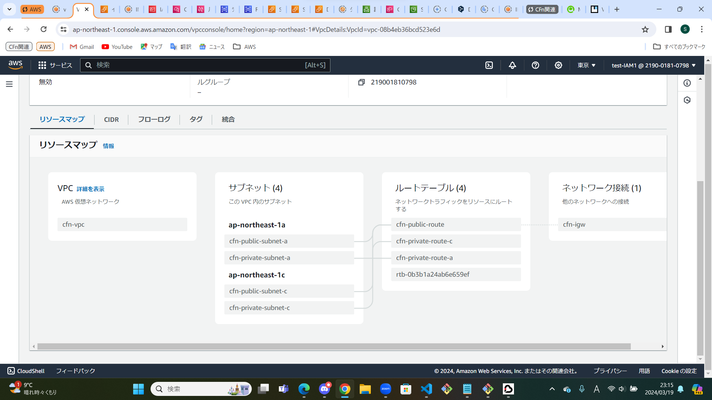

## S3

[S3用テンプレートファイル (S3.yml)](CFn-template/S3.yml)

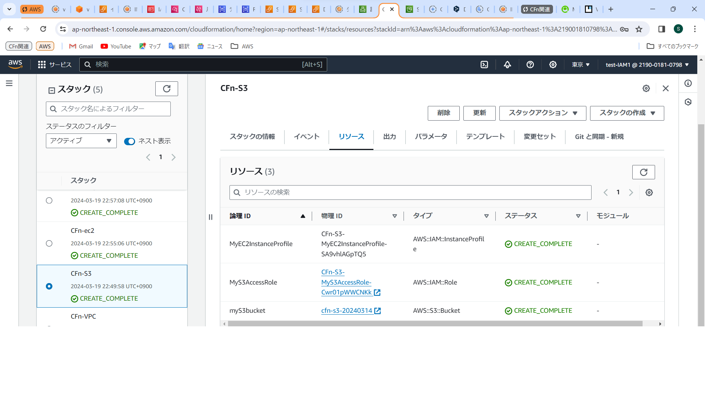
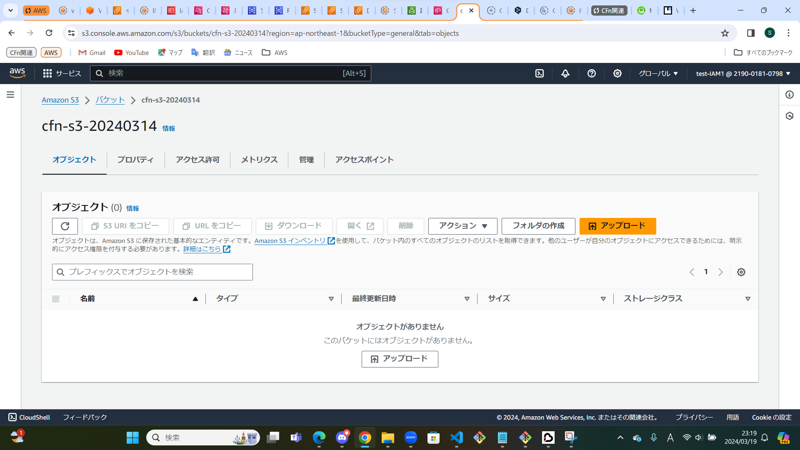

## EC2

[EC2用テンプレートファイル (EC2.yml)](CFn-template/EC2.yml)

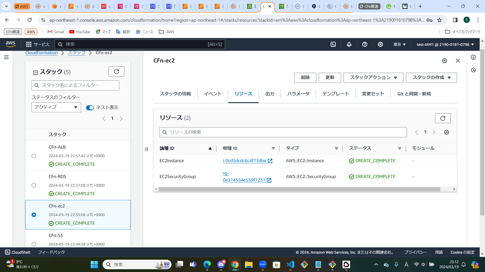
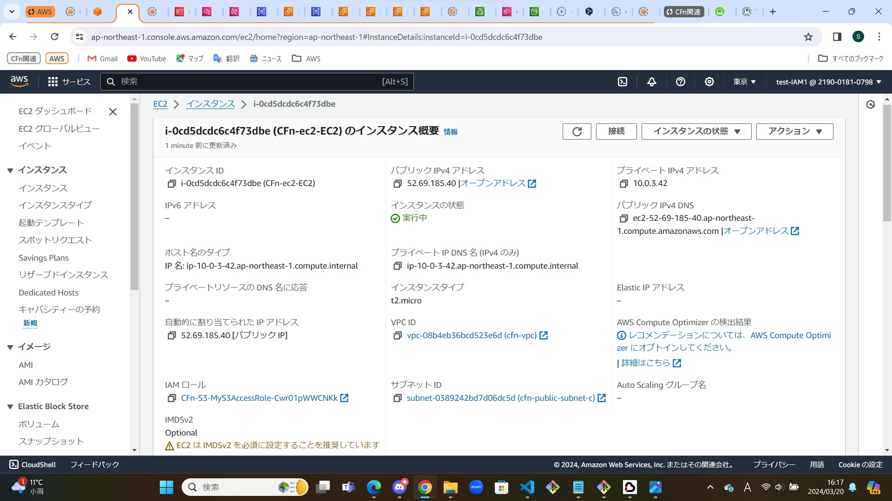
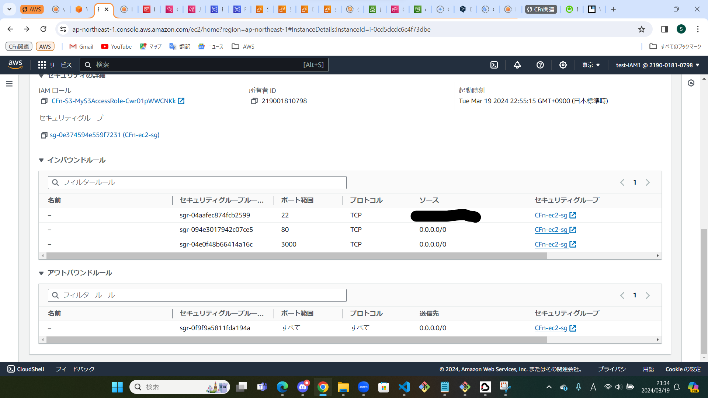

## RDS

[RDS用テンプレートファイル (RDS.yml)](CFn-template/RDS.yml)

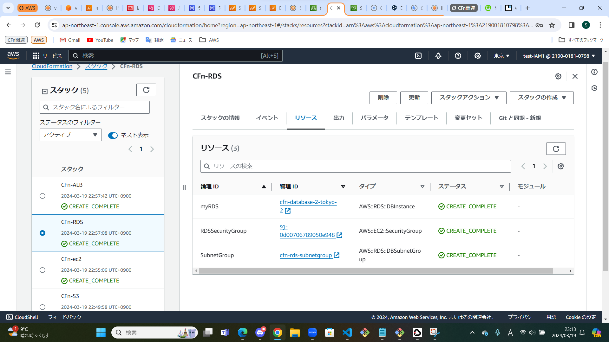
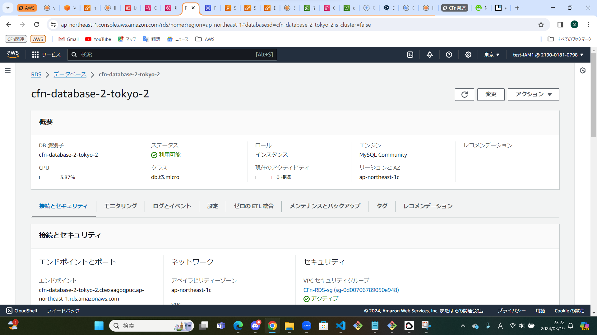
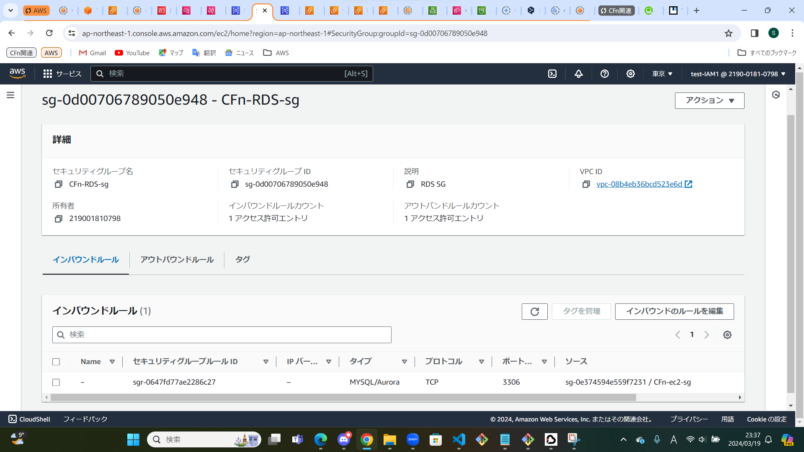

## ALB

[ALB用テンプレートファイル (ALB.yml)](CFn-template/ALB.yml)

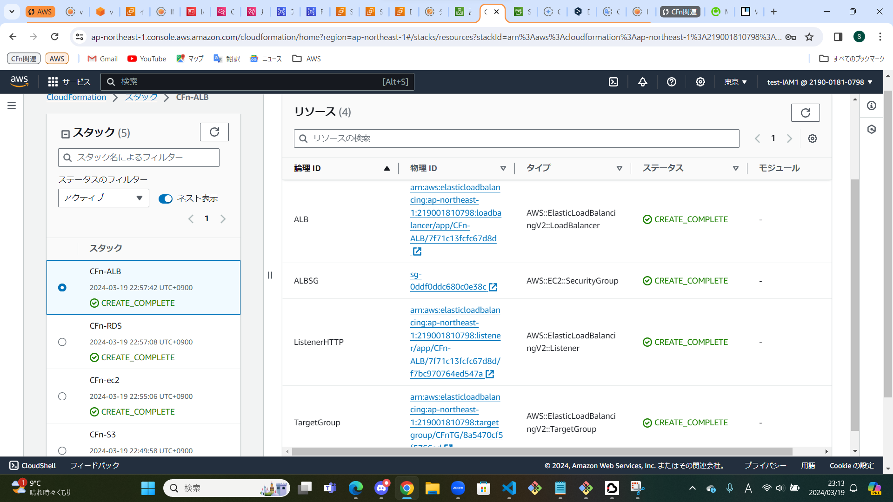
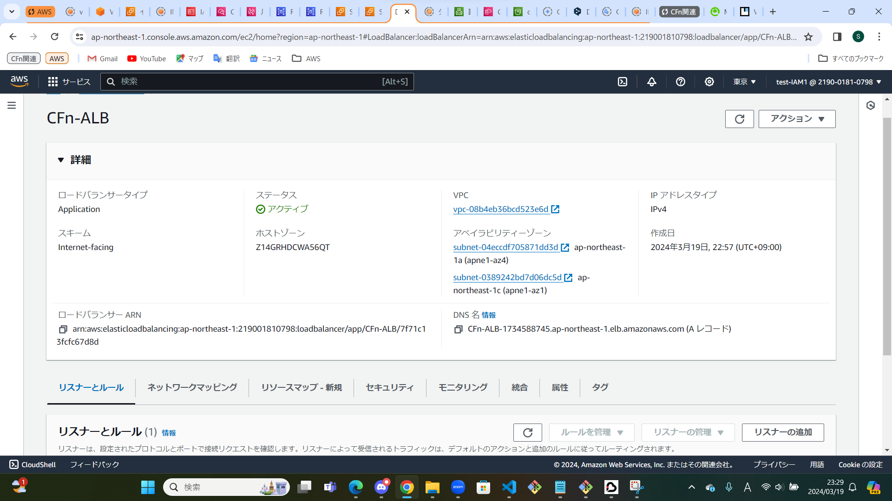
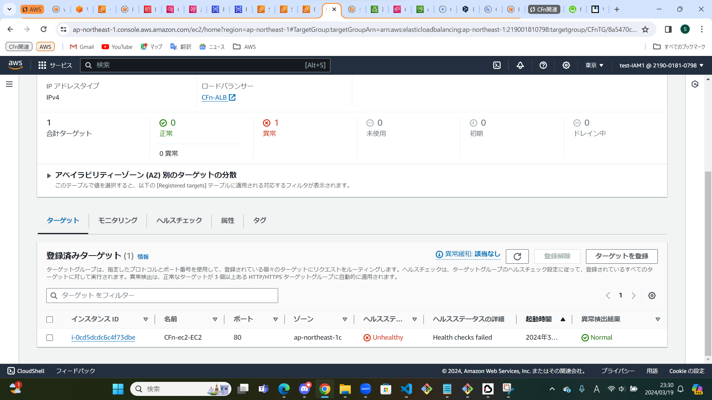
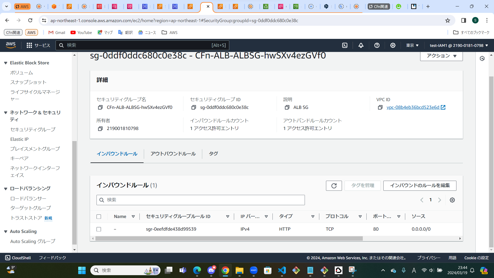
