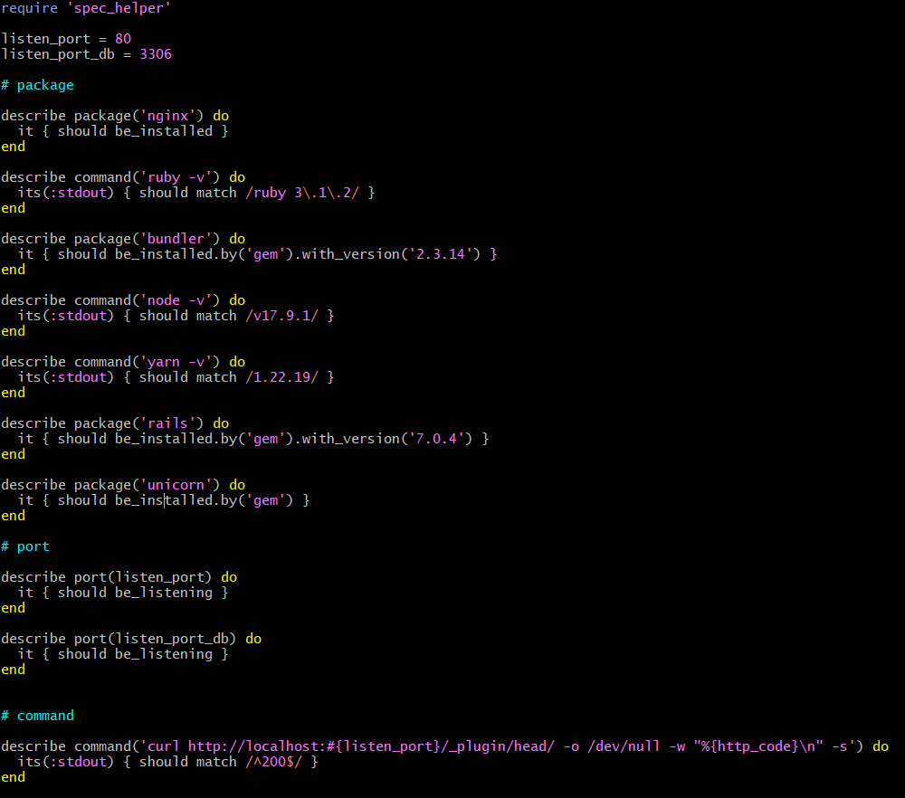
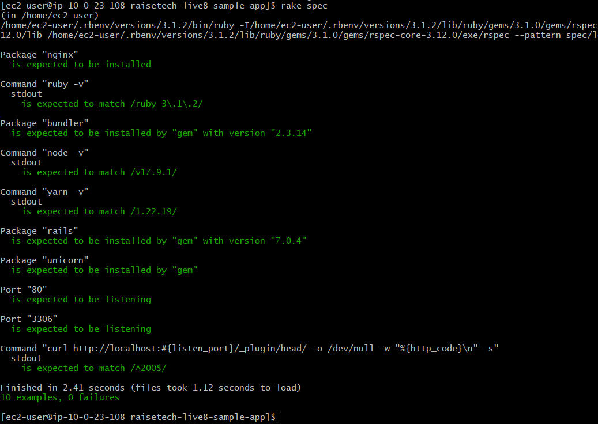

# lecture11

## 課題
・ServerSpecのテストを成功させる(テストは自分でカスタマイズする)。

### テスト内容

今回追加した内容
```
# ruby のバージョン一致確認。    
    describe command('ruby -v') do
      its(:stdout) { should match /ruby 3\.1\.2/ }
    end

# bundler のバージョン一致確認。
    describe package('bundler') do
      it { should be_installed.by('gem').with_version('2.3.14') }
    end

# node のバージョン一致確認。
    describe command('node -v') do
      its(:stdout) { should match /v17.9.1/ }
    end

# yarn のバージョン一致確認。
    describe command('yarn -v') do
      its(:stdout) { should match /1.22.19/ }
    end

# rails のバージョン一致確認。
    describe package('rails') do
      it { should be_installed.by('gem').with_version('7.0.4') }
    end

# unicorn がインストールされているかの確認。
    describe package('unicorn') do
      it { should be_installed.by('gem') }
    end

# 3306番ポートが接続を受け付けているかの確認。
    listen_port_db = 3306

    describe port(listen_port_db) do
      it { should be_listening }
    end
```
テスト全容


### テスト結果


