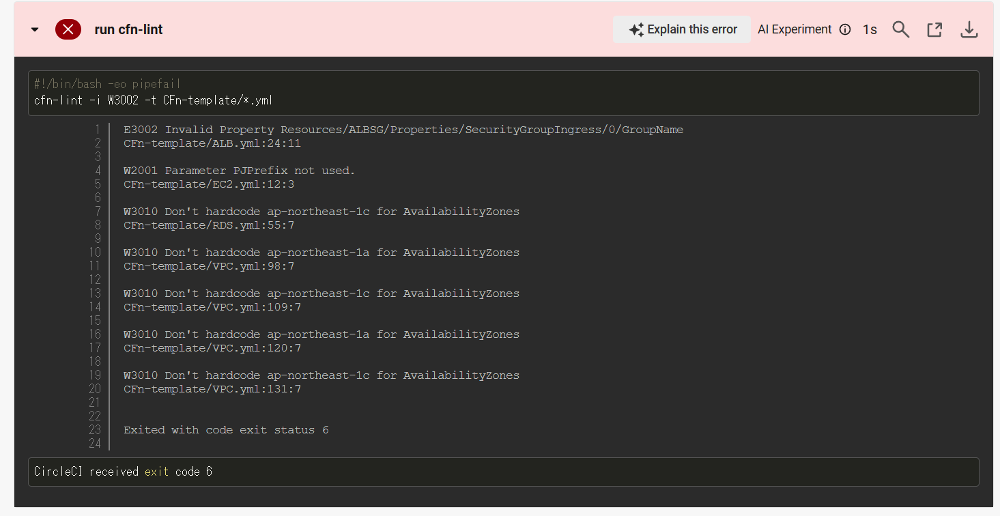
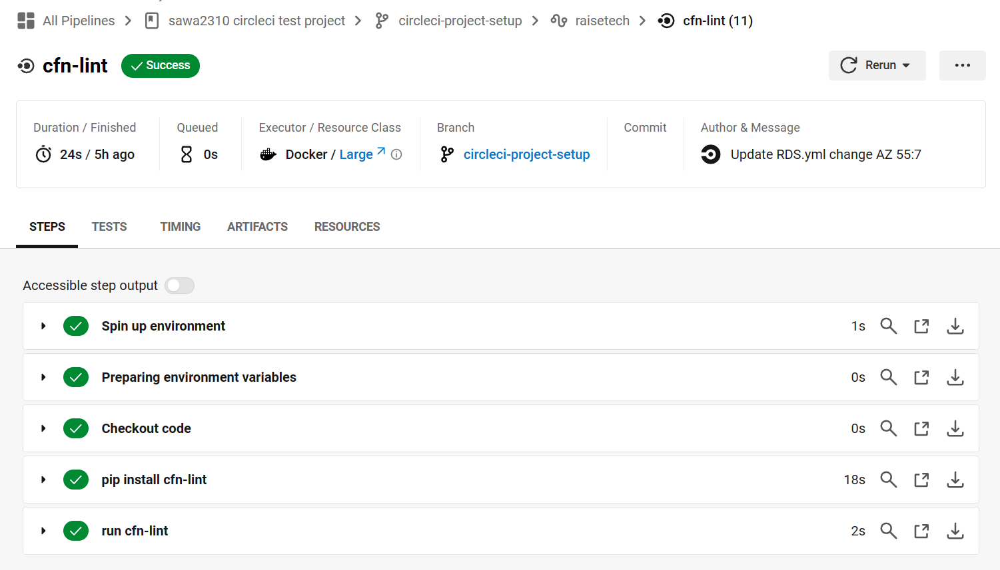
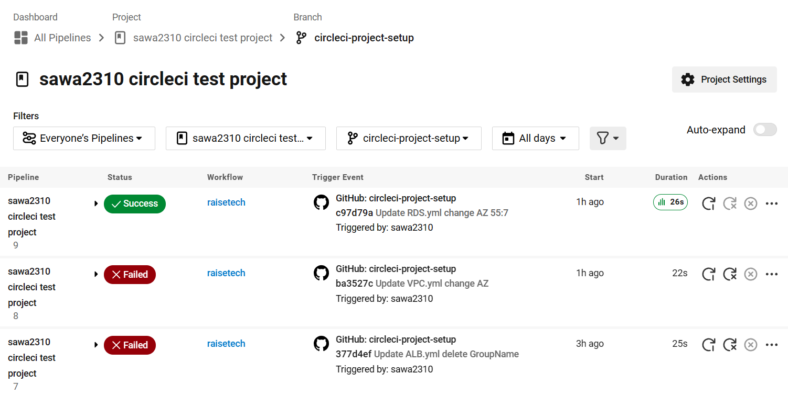

# lecture12

## 課題
    ・CircleCI のサンプルコンフィグが正しく動作するようにリポジトリに組み込む。

### CircleCIのサンプルコンフィグを実行

今回使用したサンプルコンフィグ（[config.yml](https://github.com/MasatoshiMizumoto/raisetech_documents/blob/main/aws/samples/circleci/config.yml)）

### cfn-lintでエラーが発生した部分を修正

修正内容
|  ファイル名  |  説明  |
| ---- | ---- |
|  ALB.yml  |  24行目 `GroupName: !Sub ${AWS::StackName}-sg` を削除  |
|  EC2.yml  |  12~14行目 `PJPrefix: Type: String  Default: cfn` を削除  |
|  RDS.yml  |  55行目 `AvailabilityZone: ap-northeast-1c` を `AvailabilityZone: !Select - 1 #c - Fn::GetAZs: !Ref AWS::Region` に修正  |
|  VPC.yml  |  98、120行目(修正前) `AvailabilityZone: "ap-northeast-1a"` を `AvailabilityZone: !Select - 0  # a - Fn::GetAZs: !Ref AWS::Region` に修正  |
|  VPC.yml  |  109.131行目(修正前) `AvailabilityZone: "ap-northeast-1c"` を `AvailabilityZone: !Select - 1  # c - Fn::GetAZs: !Ref AWS::Region` に修正  |

### 修正後

