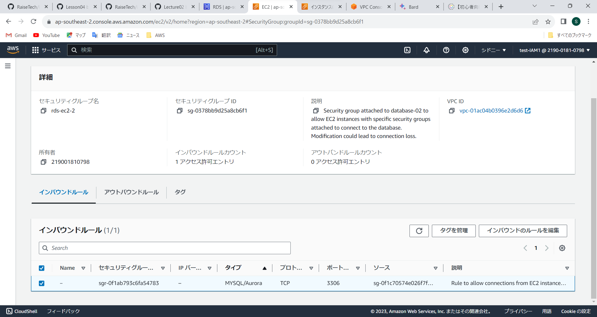

# lesson04

## AWS上に新しくVPCを作成

### サブネット

## EC2とRDSを構築

## EC2

### EC2のセキュリティグループ

## RDS

### RDSの詳細とセキュリティグループ

## EC2からRDSへの接続をし、正常であることを確認

## 学び
・ RDSにパブリックのサブネットが接続できると、誰でもRDSを閲覧できてしまうので望ましくない。
 ・ セキュリティグループが重複しないようにする
 ・ ルールは許可のルールは必要最低限で書くのが基本
